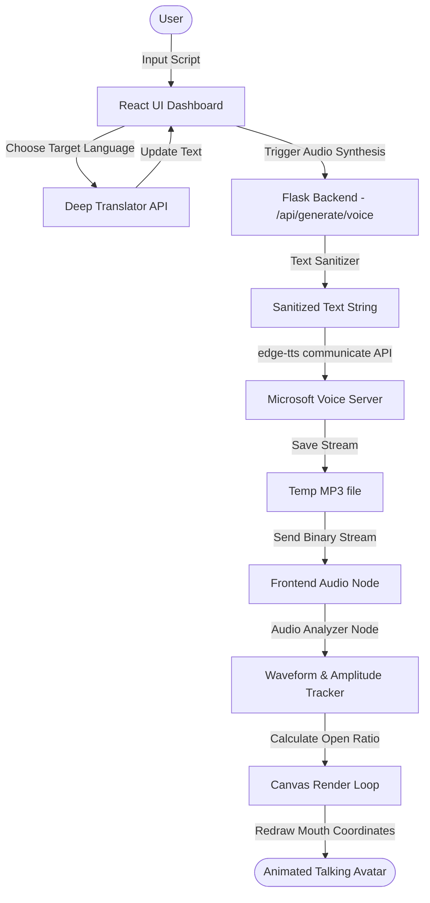

<div align="center">
  
  
  # 🎭 AI Avatar Studio
  
  [](https://vite.dev/)
  [](https://react.dev/)
  [](https://flask.palletsprojects.com/)
  [](https://tailwindcss.com/)
  [](https://github.com/rany2/edge-tts)

  *An interactive web studio leveraging generative TTS synthesis, real-time machine translation, and dynamic Canvas mouth coordinate mapping to generate lifelike digital avatars.*
</div>

---

## 🌟 Introduction

**AI Avatar Studio** is a complete full-stack platform designed to synthesize, customize, and animate digital characters. By providing scripts, choosing voices, and adjusting parameters, users can produce professional-grade talking avatars. 

The application utilizes a lightweight **Flask backend** to interface with Microsoft's Edge-TTS server for voice generation and Google Translate for localized translation, alongside a responsive **React frontend** that maps real-time mouth shapes dynamically using JavaScript audio analytics.

---

## 🛠️ Key Features

*   **🗣️ Microsoft Edge-TTS Synthesis:** Generates high-quality TTS audio in real-time across hundreds of locales. Supports custom pitch, speed rates, and multilingual voices.
*   **👄 Dynamic Lip-Sync Mapping:** Tracks the audio waveform volume and frequency to adjust character mouth coordinates dynamically on a Canvas, generating fluid, realistic lip-syncing without pre-rendered video lag.
*   **🌐 Dual-Translate Panel:** Uses the `deep-translator` engine to translate input scripts instantly into target languages (Hindi, Spanish, French, etc.) before running the speech generation.
*   **🧼 Smart Text Sanitizer:** Automatically filters out XML tags, web URLs, brackets (`[laughs]`), and parentheticals (`(smiling)`) before speech synthesis to prevent robot voice anomalies.
*   **📦 Robust Connection Retry Logic:** Backend is built with an asynchronous event loop and custom retry policies to handle gaierror or connection failures gracefully during heavy network loads.
*   **🗂️ Character Profile Hub:** Manage distinct avatar profiles with dynamic portrait changes, mouth coordinate maps, and predefined voice defaults.

---

## 📐 System Architecture Flow

Here is how the AI Avatar Studio processes inputs and animates characters:



---

## 📁 Repository Structure

```text
├── backend/
│   ├── app.py                # Flask server, translation APIs & TTS Communiciate logic
│   └── requirements.txt      # Python backend packages (edge-tts, flask-cors, deep-translator)
├── src/
│   ├── components/
│   │   └── Dashboard/
│   │       ├── CharacterManager.jsx   # Select and configure digital avatars
│   │       ├── PreviewPlayer.jsx      # Canvas playback and audio analytics renderer
│   │       └── ScriptEditor.jsx       # Script translation and inputs console
│   ├── data/
│   │   └── characters.js     # Default characters metadata and coordinates
│   ├── utils/
│   │   ├── mouthAnimation.js # Math utilities for mouth open ratio calculations
│   │   └── validation.js     # Sanitizer helper tools
│   ├── App.jsx               # Main Dashboard page layout
│   ├── main.jsx              # React mounting root
│   └── index.css             # Tailwind styling and scrollbar styles
├── package.json              # Vite & React packages
├── vite.config.js            # Vite HMR and build configs
└── README.md                 # Project showcase
```

---

## 🚀 Quick Launch

### 1. Backend Setup (Flask Server)
Navigate into the `backend/` directory and install the Python dependencies:

```bash
cd backend
python -m venv venv
# On Windows
.\venv\Scripts\activate
# On macOS/Linux
source venv/bin/activate

pip install -r requirements.txt
python app.py
```
The backend server will start on **`http://localhost:5000`**.

### 2. Frontend Setup (React App)
From the root directory, install npm packages and run the Vite dev server:

```bash
npm install
npm run dev
```
Open **`http://localhost:3000`** in your browser to load the dashboard.

---

## ⚙️ How the Lip-Sync Math Works
The real-time mouth movement is processed inside the [PreviewPlayer.jsx](file:///src/components/Dashboard/PreviewPlayer.jsx) component using the Web Audio API:

1.  **Audio Context Hook:** An `AudioContext` creates an `AnalyserNode` connected to the audio element.
2.  **Waveform Analysis:** An array of `unsigned 8-bit integers` is filled using `getByteFrequencyData` inside the animation frame loop.
3.  **Amplitude Mapping:** The average volume is mapped against a scaling factor to compute a `mouthOpenRatio` (from `0.0` to `1.0`).
4.  **Canvas Composition:** The canvas clears and redraws the character profile photo. It draws an ellipse mouth path centered at the character's designated `mouthX`/`mouthY` coordinates, sizing its height relative to the `mouthOpenRatio` and the character's custom scale metrics:
    ```javascript
    const mouthHeight = Math.max(minHeight, maxOpenHeight * mouthOpenRatio);
    ctx.ellipse(mouthX, mouthY, mouthWidth, mouthHeight, 0, 0, 2 * Math.PI);
    ```

---

## 🤝 Contributing
1. Fork the Project
2. Create your Feature Branch (`git checkout -b feature/AmazingFeature`)
3. Commit your Changes (`git commit -m 'Add some AmazingFeature'`)
4. Push to the Branch (`git push origin feature/AmazingFeature`)
5. Open a Pull Request

---

## 📜 License
Distributed under the MIT License. Developed by [Kalyan Reddy](https://github.com/kalyan-1845).
